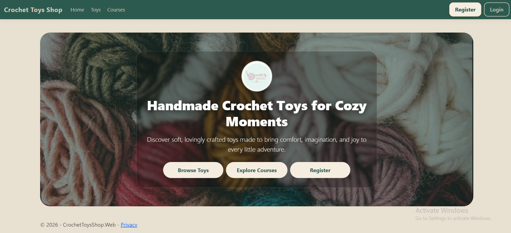
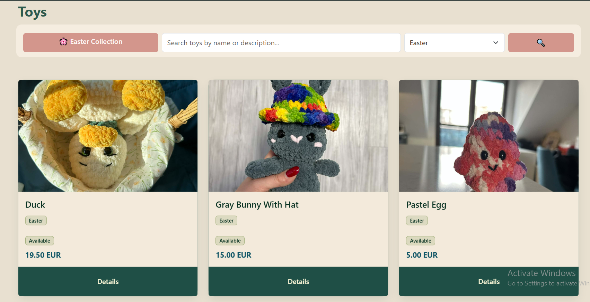
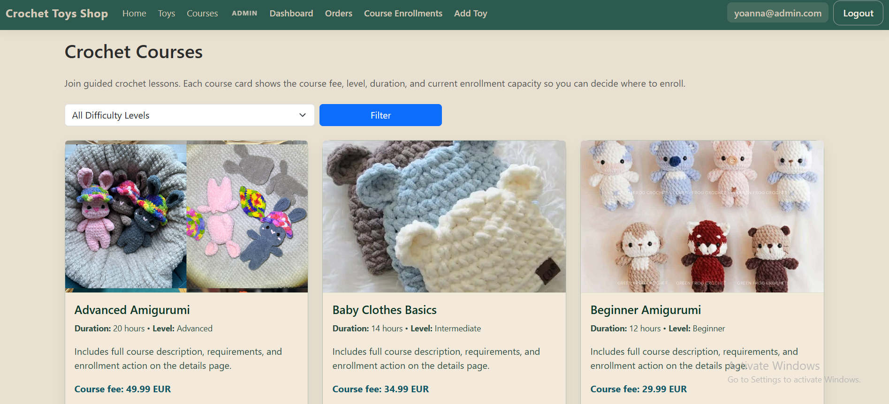
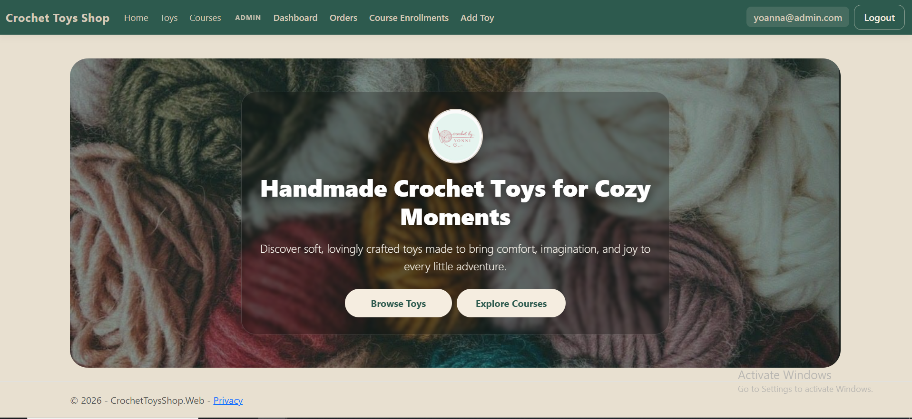

# 🧶 CrochetToysShop

> ASP.NET Core MVC final project for handmade toy ordering and crochet course enrollment.

CrochetToysShop is a web platform with two clearly separated domains:
- Handmade toys catalog with direct order requests
- Crochet learning courses with user enrollment

The project demonstrates layered architecture, role-based access control, database seeding, and automated testing.
---

## 🗂️ Project Overview

CrochetToysShop has two clearly separated domains:

- **Toys** — a public catalog with filtering, search, pagination, and single-item order requests
- **Courses** — a crochet learning system with enrollment for registered users

---

## 👤 User Roles

### Anonymous Users
- Browse toys and courses
- View details pages
- Submit toy order requests

### Registered Users (User role)
- Enroll in courses
- View enrolled courses in **My Courses**

### Administrators (Admin role)
- Access Admin Area
- Manage toys (create/edit/delete)
- Manage orders (mark completed)
- Monitor course enrollments


---

## ✨ Features

### Toys
- Public catalog with pagination, category filtering, and text search
- Availability status tracking
- Detailed product pages
- Admin CRUD operations (Create / Edit / Delete)

### Orders
- Single-item order/request flow with form validation
- Admin order management (mark as completed)

### Courses
- Public course listing with difficulty-level filtering and pagination
- Course details: duration, level, price, enrollment capacity
- Enrollment system for authenticated users
- **My Courses** page per user

---

## 🏗️ Architecture

The solution follows a **layered architecture**:

```
CrochetToysShop.Web               → MVC UI (Controllers, Views, Areas)
CrochetToysShop.Services.Core     → Business logic
CrochetToysShop.Services.Models   → Service-layer DTOs
CrochetToysShop.Data              → EF Core DbContext + migrations
CrochetToysShop.Data.Models       → Domain entities
CrochetToysShop.Web.ViewModels    → View models
CrochetToysShop.Web.Infrastructure → Helpers, extensions
CrochetToysShop.Services.Tests    → Unit tests
CrochetToysShop.IntegrationTests  → Integration tests
```

**Request flow:** `Controller → Service → EF Core → ViewModel → Razor View`

The UI uses a shared layout, partial views, and Razor sections.

---

## 🗄️ Domain Model

| Entity | Description |
|--------|-------------|
| `Toy` | Handmade product with name, description, price, category, availability |
| `Category` | Toy category (Easter, Seasonal, Flowers, Accessories) |
| `Order` | Single-item order request submitted by a user |
| `Course` | Crochet course with level, duration, price, capacity |
| `Enrollment` | Join entity between `User` and `Course` |

---

## 🔐 Security

- **ASP.NET Core Identity** with `User` and `Admin` roles
- Role-based authorization via attributes and area-based access control
- **Antiforgery tokens** applied globally
- Client-side and server-side validation on all forms
- XSS-safe Razor rendering (no `@Html.Raw` on user input)
- No raw SQL — EF Core LINQ queries only
- Custom error pages for **404 Not Found** and **500 Server Error**

---

## 🌱 Database Seeding

On first run the database is seeded with:

- Roles: `Admin`, `User`
- Admin account (yoanna@admin.com / password: Admin1)
- Categories
- Sample toys (including Easter, Seasonal, Flowers, and Accessories collections)
- Sample courses (Beginner / Intermediate / Advanced Amigurumi, Baby Clothes Basics)

---

## ⚙️ Setup

### Requirements
- .NET 8
- SQL Server (LocalDB is supported)

### Run

```bash
dotnet restore
dotnet ef database update --project CrochetToysShop.Data --startup-project CrochetToysShop.Web
dotnet run --project CrochetToysShop.Web

```
---

## 🧪 Testing

### Test projects

| Project | Type |
|---------|------|
| `CrochetToysShop.Services.Tests` | Unit tests |
| `CrochetToysShop.IntegrationTests` | Integration tests |

### Results

- ✅ **63 service tests** passed
- ✅ **9 integration tests** passed

```bash
dotnet test --collect:"XPlat Code Coverage"
```

### Coverage (Services.Core)

| Metric | Coverage |
|--------|---------|
| Line | ~97% |
| Branch | ~74% |

---

## 🛒 Order Flow Design

The application intentionally uses a **single-item order/request flow** instead of a shopping cart.

This design choice:
- simplifies the user experience
- reflects the nature of handmade, custom orders
- avoids unnecessary complexity for bulk purchasing

---

## 🔮 Future Improvements

- Shopping cart system
- Admin analytics dashboard
- Deployment pipeline (Azure)


## 📸 Screenshots

### Home Page


### Toys Catalog


### Courses Page


### Admin Dashboard

